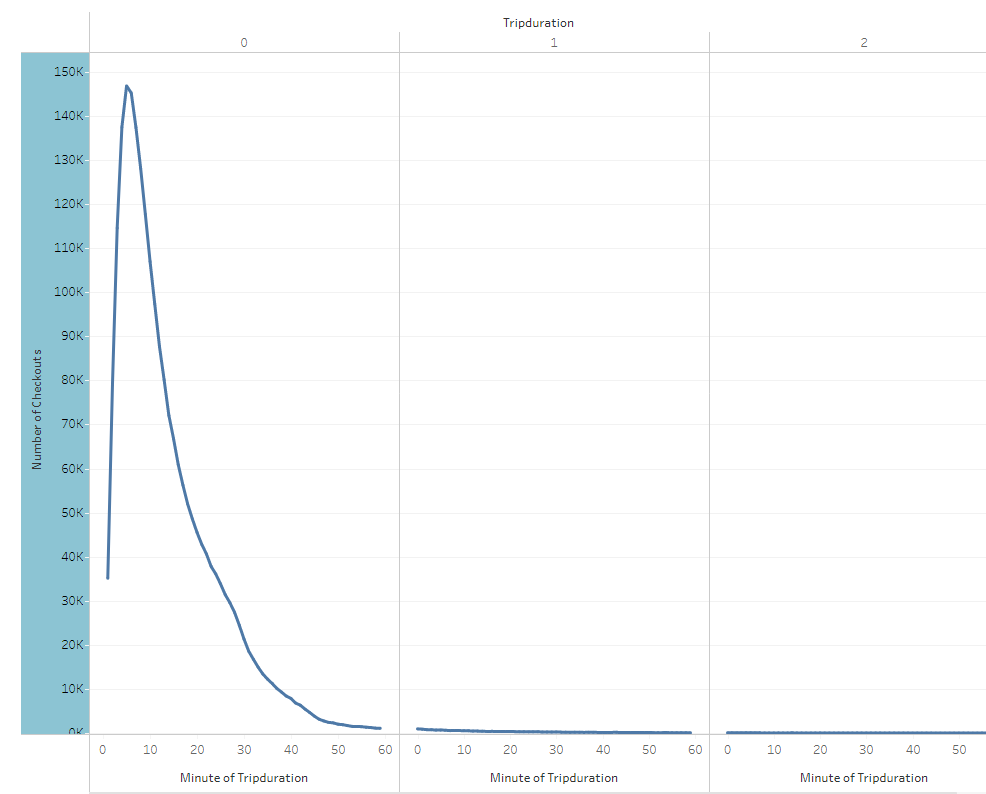
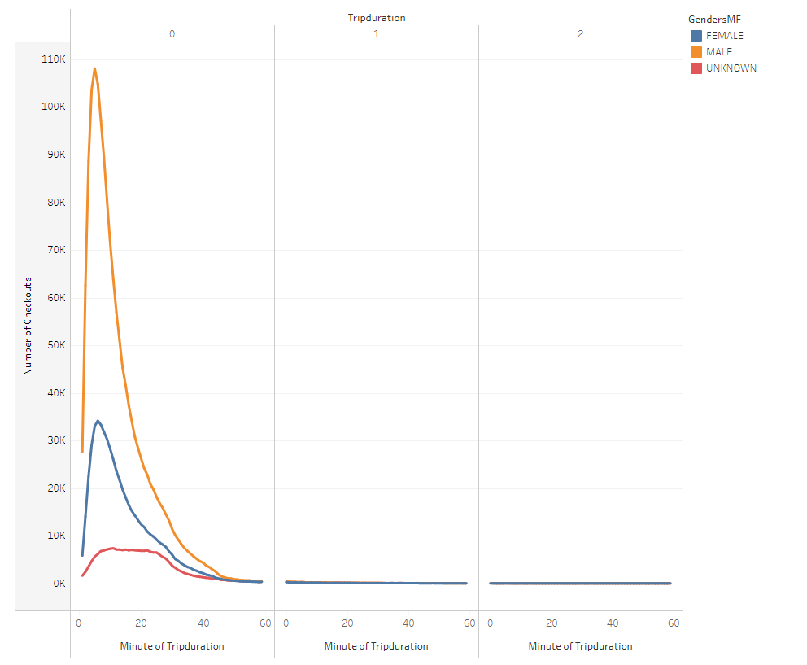
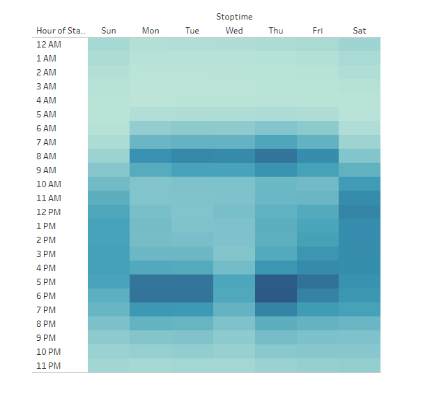
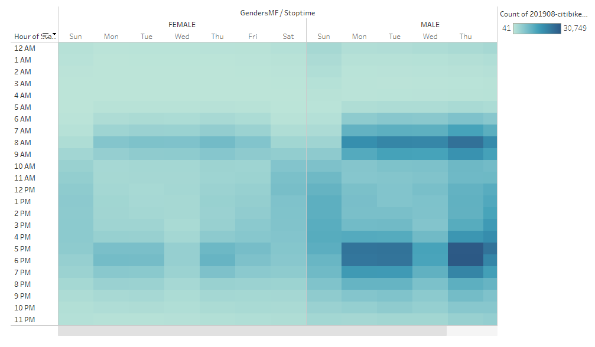
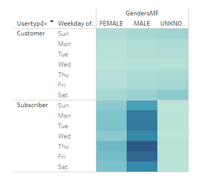
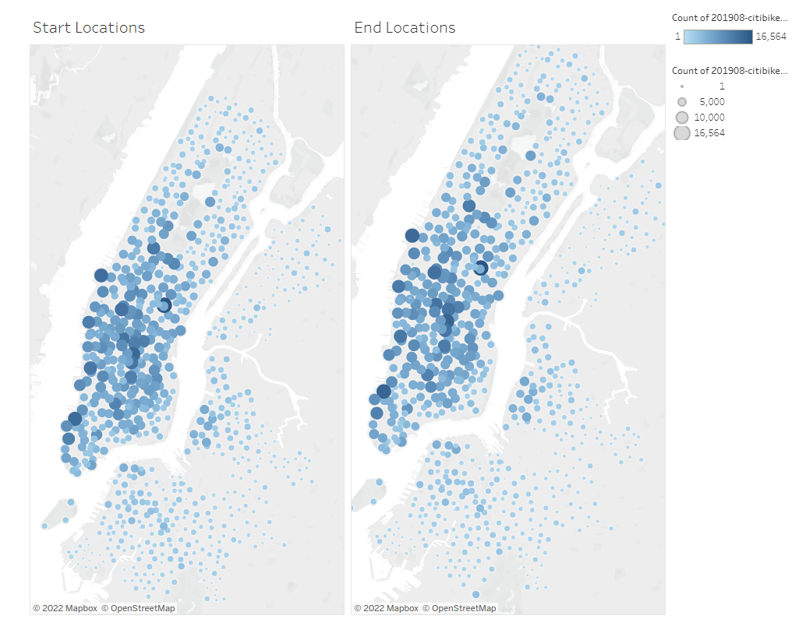
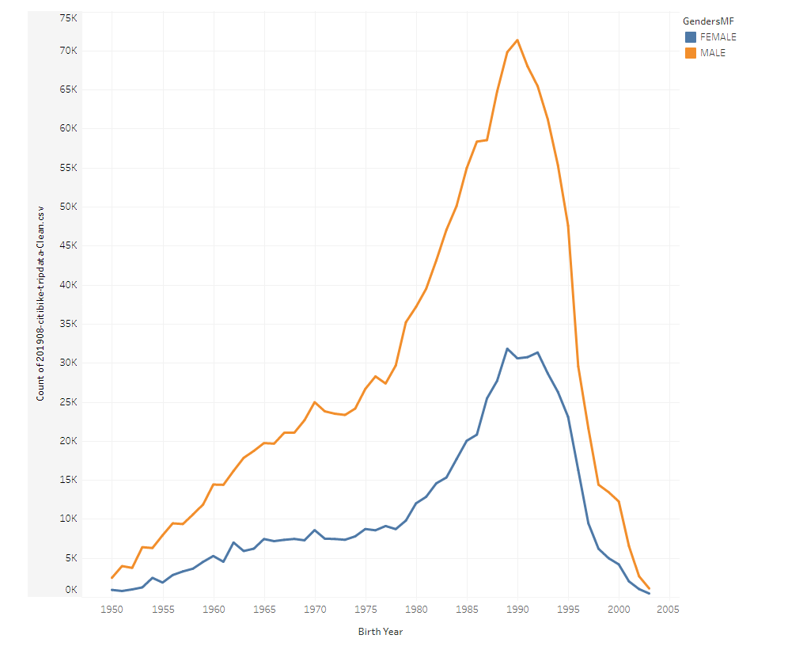

# RBCModule14-Challenge

## Overview of the Analysis

This analysis is meant to exemplify usage of Tableau through a analysis of 2018 CitiBike Data based in New York, NY. Our results in Tableau Public can be found [here](https://public.tableau.com/app/profile/noah.s.winslow/viz/RBCModule14-Challenge/CitiBikeUsageBreakdown).

## Results

Here we show the length of trips vs number of bikes checked out. As we can see, the vast majority of the bike trips are shorter than 20 minutes.

Looking at the breakdown of the same chart by gender, we see that there is no noticible gender bias towards the duration of trips.

Looking now at the StartTime vs Weekday, we see expected rates except for a noticible gap on Wednesday evenings.

Breaking this down by gender, we see a light bias for males to use the bikes on weekends over the female users.

If we look at which users are "Customers" vs "Subscribers" we see that most of our male users are subscribers while for females it is only mildly so.

Examining the starting and ending locations, it is not clear that there is any particular flow of bikes in one direction over another, though perhaps slightly more "outwards" as individuals use the bikes to return to the outskirts of the city.

Finally, we see that there is no clear gender bias relative to the age of our users, but it is clear that the vast majority of our users are younger, having been born between the years 1985 and 1995, putting them at around 30 years of age. It is interesting to remark upon the plateau of users that occur born between the years 1965 and 1980.

## Summary

In conclusion, it seems there is broad adoption of the bike share program across Manhattan Island with Males taking up the majority of usage. Peak hours are during mornings, afternoons and weekends as expected. Some additional visualizations that might be fruitful are comparing male and female usage vs starting/ending locations and a better tracking of bike flows via comparisons of BikeIds vs their starting and ending locations. 